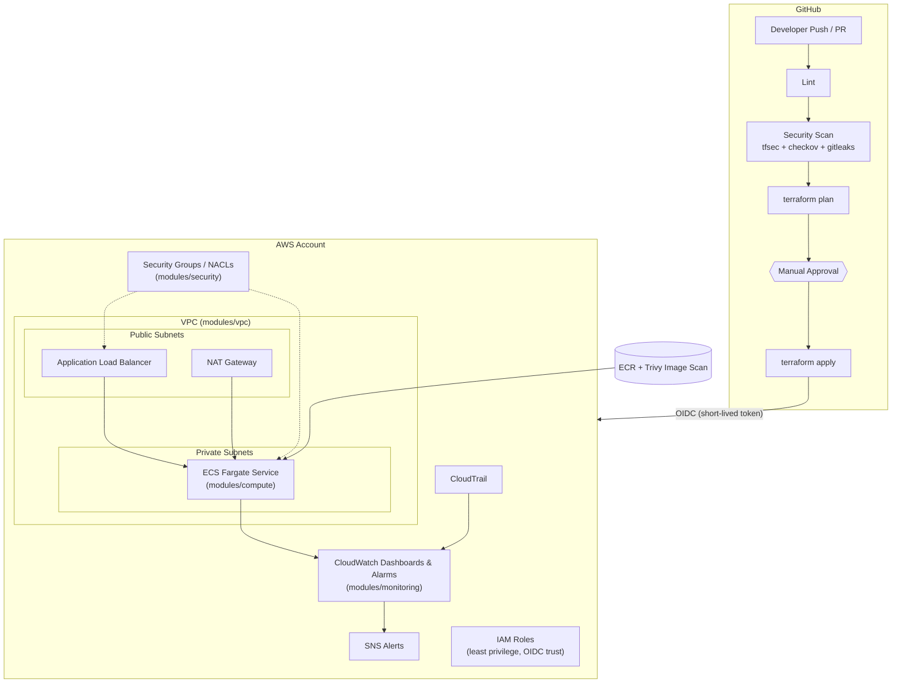

# Secure CI/CD Platform on AWS

A production-style DevSecOps reference platform: modular Terraform infrastructure, a GitHub Actions pipeline with security gates, and AWS-native monitoring — built to demonstrate secure, auditable infrastructure delivery end to end.

> **Status:** 🚧 Infrastructure, security tooling and CI/CD pipeline are built. Remaining: real screenshots once a pipeline has actually run (`docs/screenshots/`).

## Table of Contents

- [Overview](#overview)
- [Architecture](#architecture)
- [Repository Structure](#repository-structure)
- [Prerequisites](#prerequisites)
- [Getting Started](#getting-started)
- [CI/CD Pipeline](#cicd-pipeline)
- [Security Controls](#security-controls)
- [Monitoring & Logging](#monitoring--logging)
- [Environments](#environments)
- [Screenshots](#screenshots)

## Overview

This project shows how to run infrastructure changes through the same rigor as application code:

- **Infrastructure as Code** — modular Terraform (VPC, security, compute, monitoring), separated per environment.
- **CI/CD** — GitHub Actions pipeline: lint → security scan → `terraform plan` → manual approval → `terraform apply`, authenticating to AWS via OIDC (no long-lived access keys).
- **DevSecOps** — secret scanning (gitleaks) pre-commit and in CI, IaC scanning (tfsec + checkov), container scanning (Trivy) for the sample app, least-privilege IAM.
- **Observability** — CloudWatch dashboards and alarms, CloudTrail audit logging, alerting on suspicious security events.

## Architecture



*(Diagram renders natively on GitHub / any Mermaid-compatible viewer.)*

## Repository Structure

```
secure-cicd-platform/
├── environments/
│   ├── staging/             # Root Terraform config for staging (calls modules/*)
│   └── production/          # Root Terraform config for production
├── modules/
│   ├── vpc/                  # Networking: VPC, public/private subnets, routing, flow logs
│   ├── security/              # Security Groups, NACLs
│   ├── compute/                # ECS Fargate service, ALB, ECR
│   └── monitoring/             # CloudWatch dashboards/alarms, CloudTrail, SNS alerts
├── bootstrap/
│   └── github-oidc/          # One-time, manually-applied: GitHub OIDC provider + CI IAM roles
├── app/                      # Sample containerized demo app (build/scan/deploy target)
├── .github/workflows/
│   ├── terraform-pipeline.yml    # lint -> security scan -> plan -> approve -> apply
│   └── docker-build-scan.yml     # build -> Trivy scan -> push to ECR -> deploy to ECS
├── docs/                     # Architecture notes, screenshots
├── scripts/
│   └── bootstrap-backend.sh  # One-time: creates the S3 + DynamoDB Terraform state backend
├── .pre-commit-config.yaml   # gitleaks + terraform hooks, run before every commit
├── .gitleaks.toml            # Secret-scanning rules
└── README.md
```

## Prerequisites

- Terraform >= 1.7
- AWS CLI v2, with an AWS account and permissions to bootstrap the state backend and OIDC roles (one-time, human-run steps below)
- A GitHub repository with Actions enabled
- [pre-commit](https://pre-commit.com/) installed locally (`pip install pre-commit` or `brew install pre-commit`)
- Docker (only needed to build/scan the sample app locally)
- `tfsec` and `checkov` installed locally if you want to run the same scans pre-push (both also run in CI)

## Getting Started

Three one-time, human-run steps before the pipeline can run on its own — after that, everything below is automated by `.github/workflows/`.

**1. Install git hooks** (secret scanning + Terraform checks before every commit):

```bash
pre-commit install
```

**2. Bootstrap the Terraform state backend** (creates the S3 bucket + DynamoDB lock table):

```bash
./scripts/bootstrap-backend.sh          # defaults to us-east-1
```

Update the `bucket` value in `environments/*/backend.tf` (or your GitHub
Actions variables, see below) to the bucket name it prints.

**3. Bootstrap GitHub OIDC + CI IAM roles** (lets Actions authenticate to AWS with no stored keys):

```bash
cd bootstrap/github-oidc
cp terraform.tfvars.example terraform.tfvars   # fill in your GitHub org/repo + state bucket
terraform init && terraform apply
```

Take the three role ARNs from the output and configure GitHub (Settings >
Secrets and variables, and Settings > Environments):

| Where | Name | Value |
|---|---|---|
| Repository variable | `AWS_REGION` | e.g. `us-east-1` |
| Repository variable | `TF_STATE_BUCKET` | from step 2 |
| Repository variable | `TF_LOCK_TABLE` | from step 2 (`secure-cicd-tf-locks`) |
| Repository variable | `AWS_ROLE_ARN` | `plan_role_arn` output — read-only, used by lint/scan/plan |
| Environment `staging` secret | `AWS_ROLE_ARN` | `staging_deploy_role_arn` output |
| Environment `production` secret | `AWS_ROLE_ARN` | `production_deploy_role_arn` output |

Also add a **required reviewers** protection rule on the `production`
GitHub Environment — that rule *is* the manual approval gate in the
pipeline spec (see `bootstrap/github-oidc/README.md` for why).

From here on, open a PR touching `environments/` or `modules/` and the
pipeline runs itself: lint → security scan → plan (posted as a PR
comment) → merge to `main` → auto-apply to staging → apply to production
once approved.

**Local, one-off Terraform run** (e.g. to inspect a plan without waiting on CI):

```bash
cd environments/staging
terraform init \
  -backend-config="bucket=<your-state-bucket>" \
  -backend-config="dynamodb_table=secure-cicd-tf-locks"
terraform plan
```

## CI/CD Pipeline

**`.github/workflows/terraform-pipeline.yml`** — triggered on PRs and
pushes to `main` that touch `environments/**` or `modules/**`:

```
lint → security scan (tfsec + checkov + gitleaks) → plan (staging & production)
     → apply staging (auto)
     → apply production (manual approval via GitHub Environment protection rule)
```

- **Lint** — `terraform fmt -check`, `terraform validate` (both
  environments), `tflint` (informational for now).
- **Security scan** — `tfsec` and `checkov` against `modules/` and
  `bootstrap/` (hard gate — this repo currently passes both at 0
  failures; see the `tfsec:ignore` / `#checkov:skip` comments throughout
  `modules/*/main.tf` for the documented, reviewed exceptions), plus
  `gitleaks` for secrets.
- **Plan** — runs for both environments, uploads the plan as a build
  artifact, and posts it as a PR comment so reviewers see the exact
  infrastructure diff before anything merges.
- **Apply staging** — automatic once merged to `main`, using the plan
  artifact from the plan step (never a fresh, unreviewed plan).
- **Apply production** — same pattern, but the job declares
  `environment: production`; GitHub pauses it until a required reviewer
  approves, and the production IAM role's OIDC trust policy only accepts
  tokens carrying that exact environment claim (see
  `bootstrap/github-oidc/`).

**`.github/workflows/docker-build-scan.yml`** — triggered on changes
under `app/**`: builds the demo app image, scans it with Trivy (hard gate
on CRITICAL/HIGH), and — outside pull requests — pushes it to the target
environment's ECR repo and rolls the ECS service to the new image via
`aws-actions/amazon-ecs-deploy-task-definition`. Pushes to `main` deploy
to staging automatically; a manual `workflow_dispatch` run can target
production (same Environment approval gate as above).

Authentication throughout is via GitHub's OIDC provider → short-lived AWS
STS tokens — no `AWS_ACCESS_KEY_ID` / `AWS_SECRET_ACCESS_KEY` are stored
anywhere in this repo or its GitHub settings.

> **Note:** `gitleaks/gitleaks-action` is free for public repos and
> personal-account repos; on an organization-owned private repo it needs a
> `GITLEAKS_LICENSE` secret (see [gitleaks.io](https://gitleaks.io)) — add
> one if the `security-scan` job's gitleaks step fails with a license
> error.

## Security Controls

- **Secret scanning** — `gitleaks`, both as a pre-commit hook
  (`.pre-commit-config.yaml`) and in CI (`security-scan` job) on every PR.
- **IaC scanning** — `tfsec` + `checkov` as a hard CI gate on
  `modules/` and `bootstrap/`. Every accepted exception is an inline
  `tfsec:ignore:<rule-id>` / `#checkov:skip=<CKV-id>` comment with a
  one-line justification next to the resource it applies to — nothing is
  silently suppressed.
- **Container scanning** — Trivy scans the demo app's image on every
  build (`docker-build-scan.yml`), hard-failing on CRITICAL/HIGH
  vulnerabilities.
- **Least-privilege IAM**:
  - Three distinct CI roles (`plan` read-only, `staging-deploy`,
    `production-deploy`), each trusted only for its specific GitHub OIDC
    claim — see `bootstrap/github-oidc/`.
  - Per-module runtime roles (ECS task execution vs. task role, VPC flow
    log publisher, CloudTrail-to-CloudWatch-Logs) scoped to exactly what
    each needs, not broad managed policies.
- **Network isolation** — ECS tasks run in private subnets with no
  public IP; only the ALB is internet-facing, and only on the ports
  `alb_ingress_cidrs` allows (tighten this for production — see
  `modules/security/README.md`).
- **Encryption at rest** — every resource that supports it uses a
  dedicated, rotated KMS key: ECR images, container/VPC-flow-log/
  CloudTrail CloudWatch Logs groups, the SNS alerts topic, the CloudTrail
  S3 bucket. (ALB access logs are the one exception — AWS only supports
  SSE-S3, not SSE-KMS, for that specific destination; documented inline.)

## Monitoring & Logging

- **CloudWatch dashboard** per environment — ECS CPU/memory/running task
  count, ALB request count/5xx/response time/healthy-host count
  (`modules/monitoring`).
- **CloudWatch Alarms** on ECS high CPU and ALB error rate/unhealthy
  hosts, all publishing to a KMS-encrypted SNS topic.
- **CloudTrail** — multi-region, log-file-validation-enabled, delivering
  to both an encrypted S3 bucket and CloudWatch Logs. Account-level by
  design, so only `production` creates it (`enable_cloudtrail = true`);
  `staging` reuses it — see `modules/monitoring/README.md`.
- **CIS-style security alarms**, fed by CloudTrail via CloudWatch Logs
  metric filters, on: unauthorized API calls, root account usage, IAM
  policy changes, Security Group changes, NACL changes, CloudTrail
  configuration changes, and console sign-in failures — all routed to the
  same SNS topic as the operational alarms above.

## Environments

| Environment | Purpose | Approval Required |
|---|---|---|
| `staging`    | Pre-production validation | No (auto-apply after scans pass) |
| `production` | Live environment | Yes (manual approval gate) |

## Screenshots

*(Placeholders — will be replaced with real screenshots once the pipeline and dashboards are live)*

| Terraform Plan in CI | Security Scan Results | CloudWatch Dashboard |
|---|---|---|
| `docs/screenshots/terraform-plan.png` | `docs/screenshots/security-scan.png` | `docs/screenshots/cloudwatch-dashboard.png` |
