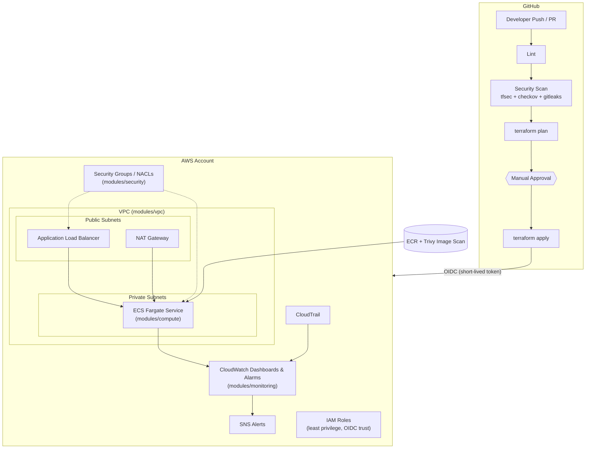

# Secure CI/CD Platform on AWS

A production-style DevSecOps reference platform: modular Terraform infrastructure, a GitHub Actions pipeline with security gates, and AWS-native monitoring — built to demonstrate secure, auditable infrastructure delivery end to end.

> **Status:** 🚧 Under active construction. This README tracks the project as it's built stage by stage; sections marked `(TBD)` will be filled in as each part lands.

## Table of Contents

- [Overview](#overview)
- [Architecture](#architecture)
- [Repository Structure](#repository-structure)
- [Prerequisites](#prerequisites)
- [Getting Started](#getting-started)
- [CI/CD Pipeline](#cicd-pipeline)
- [Security Controls](#security-controls)
- [Monitoring & Logging](#monitoring--logging)
- [Environments](#environments)
- [Screenshots](#screenshots)

## Overview

This project shows how to run infrastructure changes through the same rigor as application code:

- **Infrastructure as Code** — modular Terraform (VPC, security, compute, monitoring), separated per environment.
- **CI/CD** — GitHub Actions pipeline: lint → security scan → `terraform plan` → manual approval → `terraform apply`, authenticating to AWS via OIDC (no long-lived access keys).
- **DevSecOps** — secret scanning (gitleaks) pre-commit and in CI, IaC scanning (tfsec + checkov), container scanning (Trivy) for the sample app, least-privilege IAM.
- **Observability** — CloudWatch dashboards and alarms, CloudTrail audit logging, alerting on suspicious security events.

## Architecture



*(Diagram renders natively on GitHub / any Mermaid-compatible viewer.)*

## Repository Structure

```
secure-cicd-platform/
├── environments/
│   ├── staging/          # Root Terraform config for staging (calls modules/*)
│   └── production/       # Root Terraform config for production
├── modules/
│   ├── vpc/               # Networking: VPC, public/private subnets, routing
│   ├── security/          # Security Groups, NACLs
│   ├── compute/           # ECS Fargate service, ALB, ECR
│   └── monitoring/        # CloudWatch dashboards, alarms, CloudTrail
├── app/                    # Sample containerized demo app (for Trivy/pipeline demo)
├── .github/workflows/      # CI/CD pipeline definitions
├── docs/                   # Architecture notes, screenshots
├── scripts/                # Helper scripts (bootstrap, local checks)
├── .pre-commit-config.yaml # gitleaks + terraform hooks, run before every commit
├── .gitleaks.toml          # Secret-scanning rules
└── README.md
```

## Prerequisites

- Terraform >= 1.7
- AWS CLI v2, with an AWS account and permissions to create the OIDC identity provider / IAM roles
- GitHub repository with Actions enabled
- [pre-commit](https://pre-commit.com/) installed locally (`pip install pre-commit` or `brew install pre-commit`)
- Docker (only needed to build/scan the sample app locally)

## Getting Started

*(TBD — filled in once `environments/` and the OIDC bootstrap are built)*

```bash
# 1. Install git hooks
pre-commit install

# 2. Initialize an environment
cd environments/staging
terraform init
terraform plan
```

## CI/CD Pipeline

*(TBD — filled in with the `.github/workflows/` stage)*

Planned stages: `lint` → `security scan (tfsec, checkov, gitleaks)` → `terraform plan` → `manual approval` → `terraform apply`, authenticated via GitHub OIDC → AWS IAM role (no static access keys stored in GitHub).

## Security Controls

*(TBD — filled in with the security-tooling stage)*

- Pre-commit secret scanning via gitleaks
- Trivy image scanning for the sample app's Docker image
- IAM least-privilege roles per module
- Encryption at rest (EBS/S3/CloudWatch Logs/ECR) across all applicable resources

## Monitoring & Logging

*(TBD — filled in with `modules/monitoring`)*

- CloudWatch dashboards for infrastructure and application health
- CloudTrail for account-wide API audit logging
- CloudWatch Alarms + SNS for suspicious security events (e.g. unauthorized API calls, security group changes)

## Environments

| Environment | Purpose | Approval Required |
|---|---|---|
| `staging`    | Pre-production validation | No (auto-apply after scans pass) |
| `production` | Live environment | Yes (manual approval gate) |

## Screenshots

*(Placeholders — will be replaced with real screenshots once the pipeline and dashboards are live)*

| Terraform Plan in CI | Security Scan Results | CloudWatch Dashboard |
|---|---|---|
| `docs/screenshots/terraform-plan.png` | `docs/screenshots/security-scan.png` | `docs/screenshots/cloudwatch-dashboard.png` |
