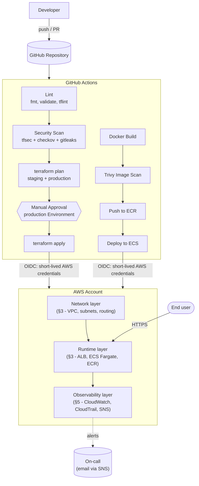
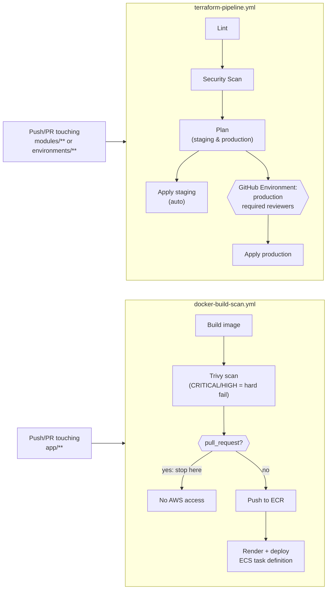
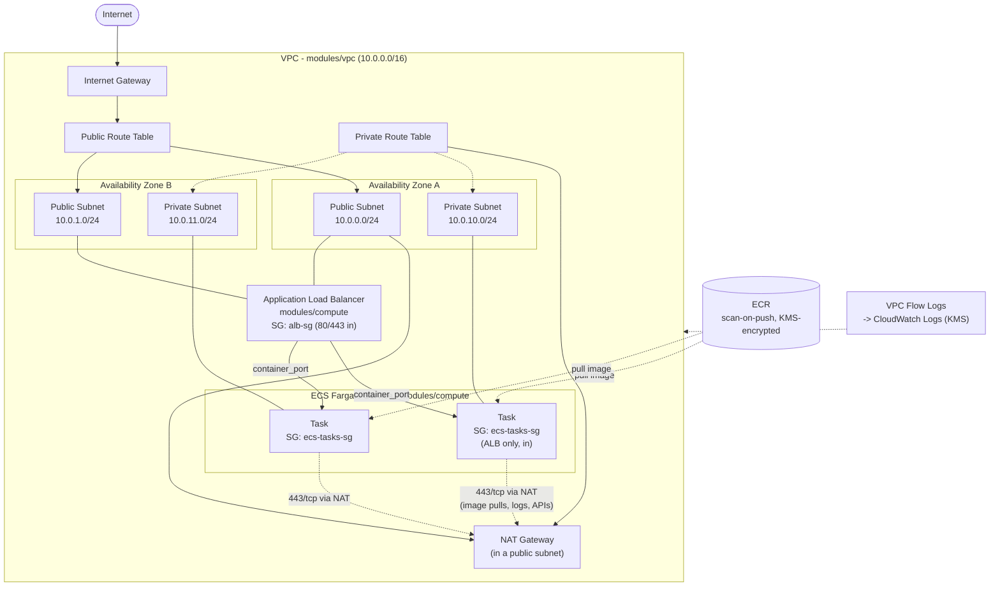
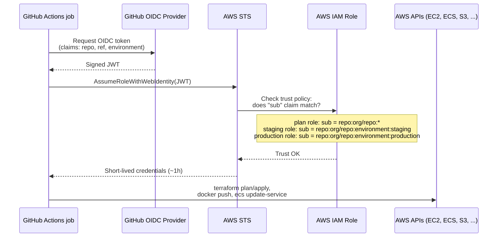
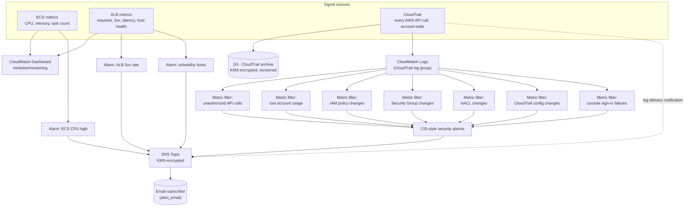

# Architecture

This document walks through the platform end to end: a change lands in
GitHub, the pipeline scans and plans it, an approved apply reaches AWS, and
the running system feeds observability data back out. Each diagram covers
one layer; together they're the full picture the [README](../README.md)
summarizes in one box.

## 1. End-to-end flow

## 2. CI/CD pipeline detail

Two independent workflows, triggered by what changed - infrastructure
(`environments/`, `modules/`) or application code (`app/`).

Trigger conditions and gates, precisely:

| Stage | Runs on | Gate |
|---|---|---|
| Lint, Security Scan, Plan | every PR and push to `main` | must pass to proceed |
| Apply staging | push to `main` only | none (staging is disposable, see `environments/staging/README` note in the root README) |
| Apply production | push to `main` only, after staging succeeds | GitHub Environment `production` required-reviewers rule |
| Docker build + Trivy scan | every PR and push touching `app/**` | Trivy CRITICAL/HIGH = hard fail |
| Push to ECR + deploy | push to `main` (→ staging) or manual dispatch (→ either) | same production Environment gate when targeting production |

## 3. Network & runtime architecture

What `modules/vpc`, `modules/security` and `modules/compute` actually build,
for one environment (staging shown; production is the same shape with a
NAT Gateway per AZ instead of one shared, per `single_nat_gateway`).

Two independent layers of network control, both defined in
`modules/security`: **Security Groups** (stateful, resource-level - the
primary control: ECS tasks are reachable only from the ALB, on the
container port, full stop) and **NACLs** (stateless, subnet-level -
defense in depth on top of that). Neither ECS task ever has a public IP;
every inbound path runs through the ALB.

## 4. Identity: how CI reaches AWS

No AWS access keys exist anywhere in GitHub. Every workflow run exchanges a
short-lived OIDC token for AWS credentials, scoped to exactly the role its
job is allowed to assume - see `bootstrap/github-oidc/`.

A job can only ever obtain production credentials by explicitly declaring
`environment: production` - which is the same job GitHub's own
required-reviewers protection rule pauses for approval. The approval gate
and the credential scope are the same mechanism, not two things that could
drift apart.

## 5. Observability & security event flow

`staging` and `production` share one CloudTrail trail, owned by
`production` (`enable_cloudtrail = true`) - CloudTrail is an account-level,
multi-region control, so creating one per environment would just produce
two overlapping trails billing and alerting on the same account activity.
Every other resource here (dashboards, ECS/ALB alarms, the SNS topic) is
per-environment. See `modules/monitoring/README.md` for the full reasoning.

## Module responsibility map

| Module | Owns | Does not own |
|---|---|---|
| `modules/vpc` | VPC, subnets, routing, NAT/IGW, Flow Logs | Security Groups, NACLs (→ `modules/security`) |
| `modules/security` | Security Groups, NACLs | The resources that use them (→ `modules/compute`) |
| `modules/compute` | ALB, ECS cluster/service/task, ECR, task IAM roles | Networking (consumes `modules/vpc` / `modules/security` outputs) |
| `modules/monitoring` | Dashboards, alarms, CloudTrail, SNS | Nothing upstream - it only reads metrics/logs the other modules emit |

`environments/staging` and `environments/production` are the only places
that wire all four together - see either one's `main.tf` for the concrete
call graph.
